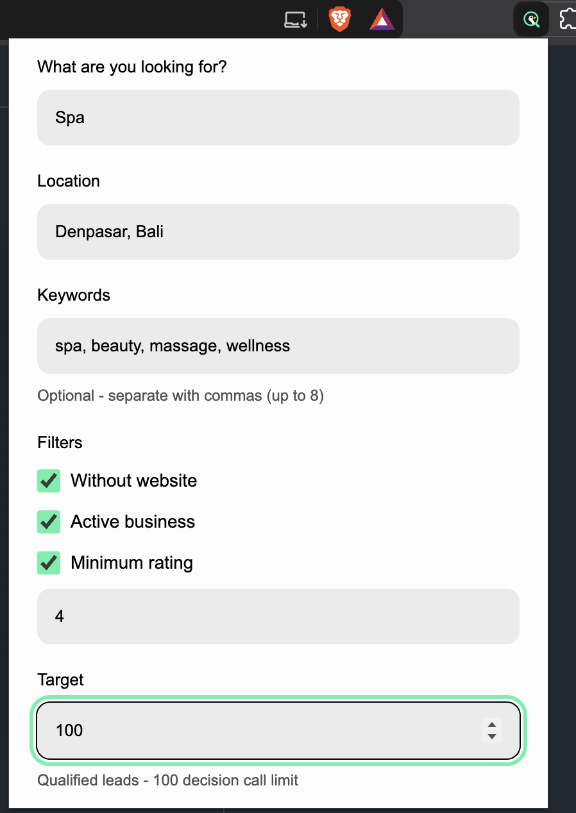
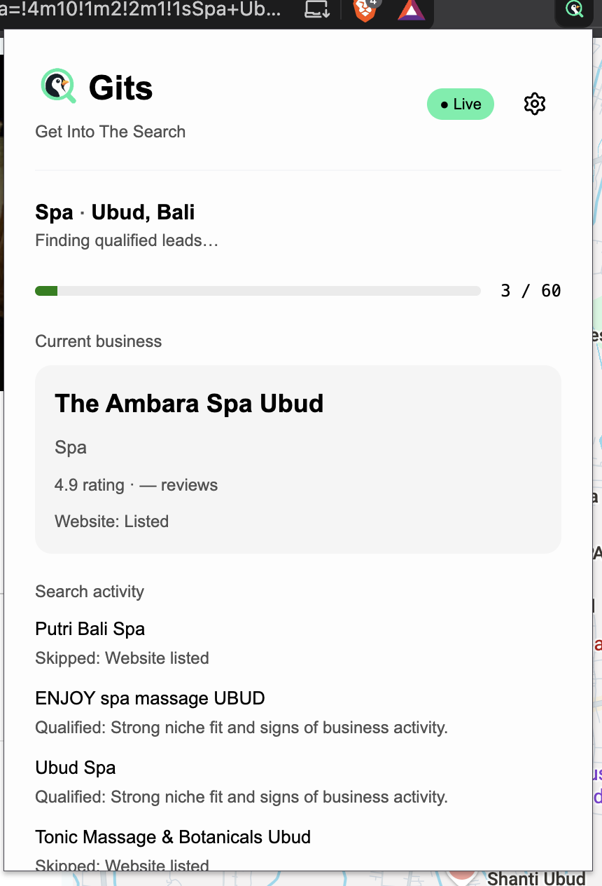
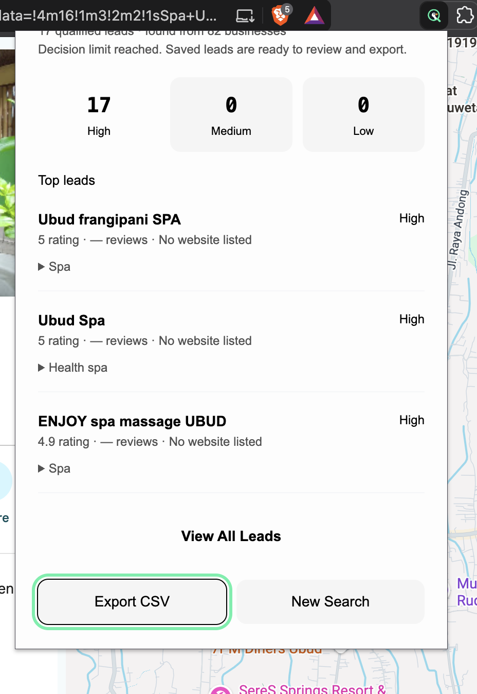
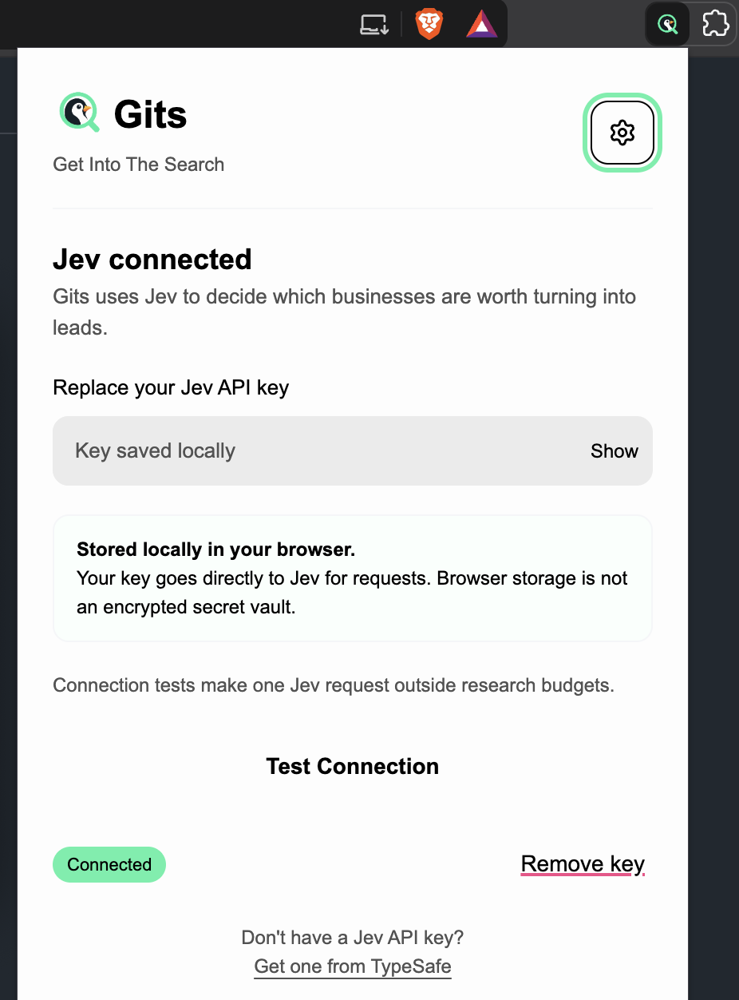

<p align="center">
  
</p>

<h1 align="center">Gits (Get Into The Search)</h1>

<p align="center">
  Gits is an open-source browser extension for user-initiated local-business lead research on Google Maps. Configure a niche, location, keywords and filters, review qualified leads and export them to CSV.
</p>

<table align="center">
  <tr>
    <td align="center" valign="top" width="50%">
      <sub>Gits Main Form</sub><br/><br/>
      
    </td>
    <td align="center" valign="top" width="50%">
      <sub>Gits Searching Process</sub><br/><br/>
      
    </td>
  </tr>
  <tr>
    <td align="center" valign="top" width="50%">
      <sub>Gits Result</sub><br/><br/>
      
    </td>
    <td align="center" valign="top" width="50%">
      <sub>Gits Settings</sub><br/><br/>
      
    </td>
  </tr>
</table>

## Tech Stack

Gits is built with the following tools, with credits to their creators:

1. [Vitesse WebExt](https://github.com/antfu-collective/vitesse-webext) - Browser extension starter template by [Anthony Fu](https://github.com/antfu).
2. [Vue](https://github.com/vuejs/core) - The Progressive JavaScript Framework
3. [Vite](https://github.com/vitejs/vite) - Development server and build tooling created
4. [UnoCSS](https://github.com/unocss/unocss) - On-demand atomic CSS engine by [Anthony Fu](https://github.com/antfu)
5. [VueUse](https://github.com/vueuse/vueuse) - Vue Composition API utilities by [Anthony Fu](https://github.com/antfu)
6. [advocaat](https://github.com/pithings/advocaat) - Type-safe AI client for TypeSafe Jev by [Pooya Parsa](https://github.com/pi0).
7. [webextension-polyfill](https://github.com/mozilla/webextension-polyfill) - Promise-based browser extension APIs by [Mozilla](https://github.com/mozilla).
8. [Vitest](https://github.com/vitest-dev/vitest) - Unit testing framework powered by Vite

## Install locally

Gits is not yet available on the Chrome Web Store. You can build and install it locally using the instructions below.

```sh
bun install
bun run build
```

In Chrome 120 or newer, open `chrome://extensions`, enable Developer mode, choose **Load unpacked**, and select the generated `extension/` directory. Open Gits from the toolbar. The starter Firefox build path is retained but Firefox behavior has not been validated.

1. Enter your Jev API key in Settings and choose **Connect & Continue**. The connection test makes one direct Jev request.
2. Set a business niche and location, optional comma-separated keywords, filters and target count.
3. **Start Research** opens a dedicated Google Maps tab. Keep it open while Gits searches. Closing the popup does not clear or stop the session.
4. Pause/resume or stop research; review saved business details and decision summaries.
5. Export CSV before choosing **New Search**, which replaces the current local result set.

## Development and checks

```sh
bun run dev          # Vitesse extension development build with HMR
bun run typecheck    # Vue templates and TypeScript
bun run test         # Vitest, non-watch mode
bun run lint
bun run build        # production bundle in extension/
```

## Architecture

- `src/popup/components/`: existing-design screens for configuration, progress, results and settings; `useResearch` handles messaging and storage notifications.
- `src/background/controller.ts`: serialized UI commands, local BYOK lifecycle, alarm recovery and tab ownership.
- `src/background/research-runner.ts`: persisted transitions; semantic decisions cannot execute arbitrary browser actions.
- `src/background/decision-engine.ts`: `JevDecisionEngine` and `MockDecisionEngine`; relevance, qualification and priority are batched into one request. Next research actions are constrained to four choices.
- `src/background/budget-guard.ts`: reserve each uncached request before dispatch and stop at the session limit; failed calls remain counted.
- `src/contentScripts/google-maps/`: explicit `search`, `scrollResults`, `openBusiness`, `readBusiness`, `backToResults` operations; selectors are separate from extraction and orchestration.
- `src/shared/`: strict domain types, deterministic filtering/configuration and CSV generation.

The runner persists every transition and resumes via a 30-second browser alarm after worker suspension. Pause/stop increments a control version so late responses cannot overwrite newer user actions. An already dispatched API call can still complete and remains counted. Connection tests are shown separately from per-session budgets.

## Data, privacy and limits

Your key, settings and active session are stored in browser-local storage, not sync storage. Local storage is not an encrypted vault. The key is sent only directly to `api.typesafe.ai` for authentication; snapshots, logs and CSV exports do not include it. Chromium content scripts are denied local-storage access. Gits has no backend, analytics or cloud account.

Selected business evidence and your brief are sent to Jev for semantic decisions. Exact duplicate detection, website checks, numeric filters, target counts and CSV generation run locally. Missing data stays unknown. “No website” means no website listed on the loaded Maps details panel, not proof that no website exists elsewhere.

Supported initially: `www.google.com/maps` with an English UI. Google Maps DOM changes may require selector maintenance. Consent must be handled manually; CAPTCHA and anti-bot states stop research. Jev thresholds and prospecting quality need evaluation against representative real searches. Users are responsible for complying with platform terms and applicable laws.

Out of scope: outreach, CRM integration, enrichment, general-purpose LLMs, other lead sources, CAPTCHA bypass, cloud synchronization and session history.

## License

Licensed under the [MIT License](LICENSE).

Copyright (c) 2026 Satya Wikananda for Gits contributions. Original Vitesse WebExt copyright (c) 2021 Anthony Fu and the MIT license notice are retained.
